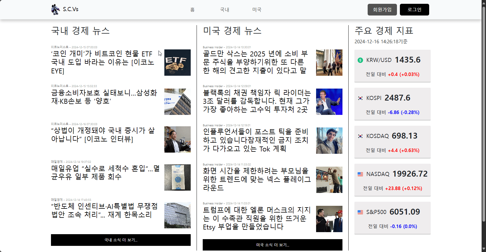
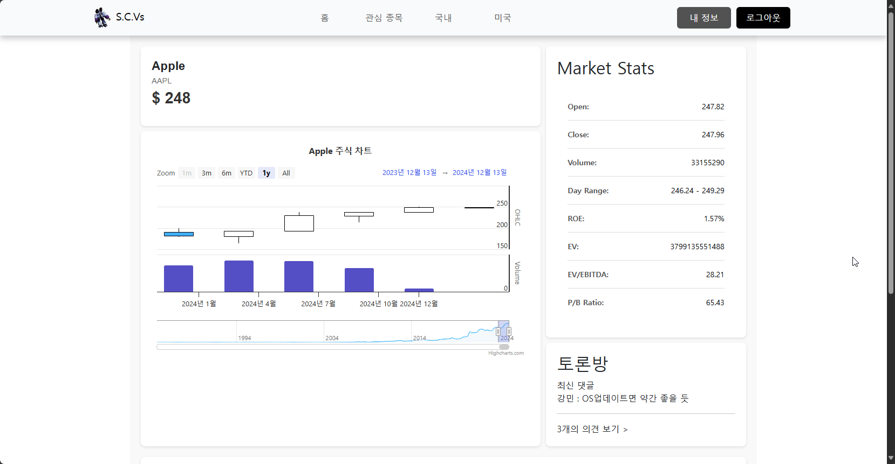
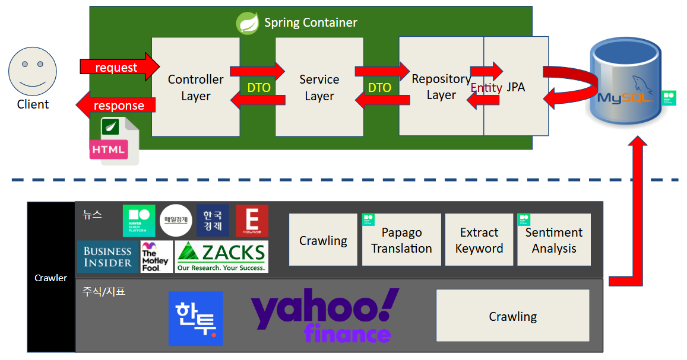
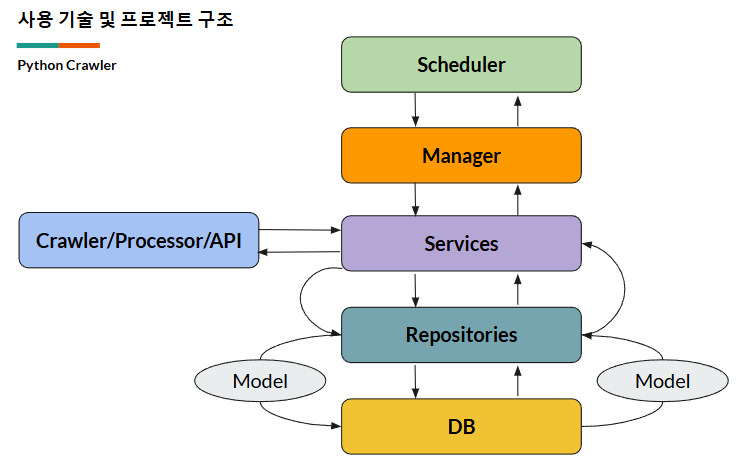
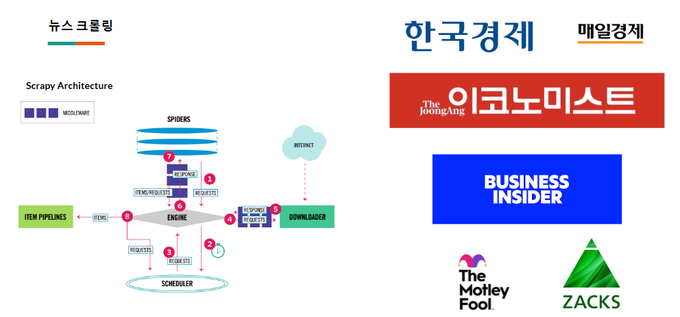
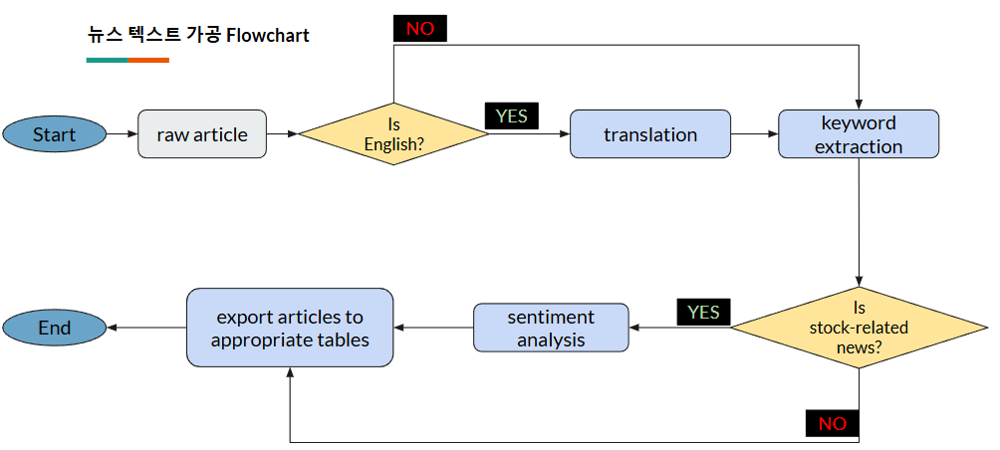
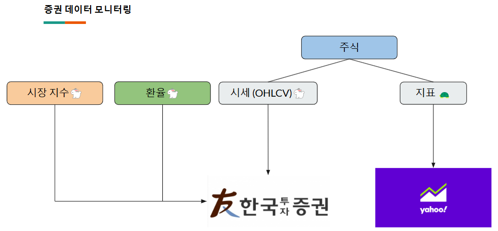
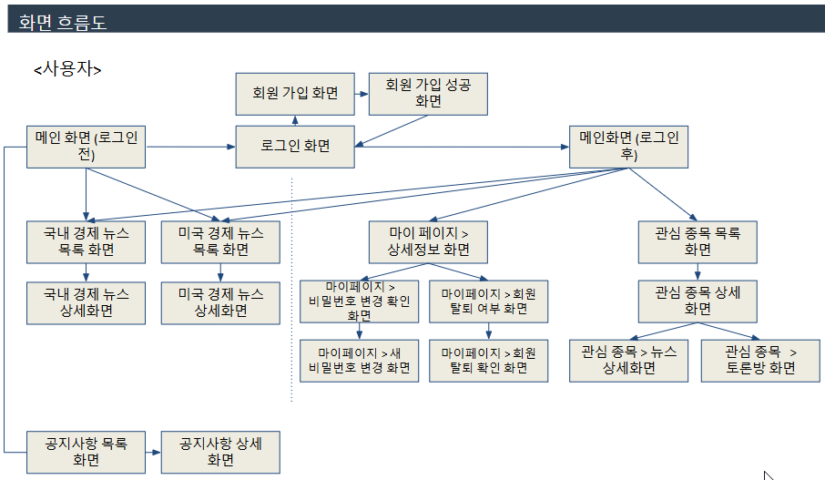

# S.C.Vs (Stocknews Collection Viewers)

<p align="center">  
  <br>
</p>

KDT 27회차 3조 팀 프로젝트입니다.

## 프로젝트 소개

S.C.Vs (Stocknews Collection Viewers)는 개인화 주식 종목 뉴스 플랫폼이란 주제로, 주식과 관련된 뉴스를 중점으로 정보들을 모아 보여주는 웹 페이지 입니다. 국내 경제 뉴스와 미국 경제 뉴스를 크롤링한 다음 번역과 가공을 통해 뉴스들을 보여주는 기능과 관심 종목에 대한 키워드 분석과 감정 분석을 하여 해당 주식에 대한 뉴스를 긍정/중립/부정으로 평가하여 보여줍니다. 또한 주식 정보와 주요 지표를 확인할 수 있으며 관심 종목에 대한 커뮤니티를 형성하여 의견을 나눌 수 있습니다. 

<br>

## 구성원

| 강민 | 하승우 | 이도훈 | 박범서 | 박주연 | 김건우 | 이기환 |
| :---: | :---: | :---: | :---: | :---: | :---: | :---: |
|  |  |  |  |  |  |  |
| [zzangkkmin](https://github.com/zzangkkmin) | [invisibleufo101](https://github.com/invisibleufo101) | [giveluck](https://github.com/giveluck) | [duddnr0514](https://github.com/duddnr0514) | [sw-jooyeon](https://github.com/sw-jooyeon) | [KGW-561](https://github.com/KGW-561) | [Lee-Gi](https://github.com/Lee-Gi) |


<br>

## 구현 기능

### 국내 & 미국 뉴스 크롤링

- 
- 국내 뉴스 사이트와 미국 뉴스 사이트에 있는 경제 / 주식 기사들을 크롤링
- 주식 종목 별 키워드로 분류
- 미국 뉴스의 경우 Papago Translation을 이용한 번역 작업
- 해당 주식에 대한 뉴스가 긍정

### 국내 & 미국 주식 정보 크롤링

- 
- 한국투자증권 API를 활용한 국내 시장 지표(KOSPI, KOSDAQ), 미국 시장 지표(NASDAQ, S&P500), 원 달러 환율 정보 추출
- yFinance API를 활용한 국내/미국 주식 정보들 추출
- 추출된 지표 정보는 메인 페이지 및 국내/미국 뉴스 페이지에서 확인
- 추출된 주식 정보는 관심 종목 세부 페이지에서 확인

### 관심 주식 커뮤니티

- 
- 사용자가 관심 주식을 선택한 다음, 그 주식에 대한 긍정/부정 투표 가능
- 관심 주식에 대한 댓글을 남겨 그 주식의 관심있는 다른 사용자와 함께 의견 공유

### 그 외

- 로그인 / 계정 정보
- 공지사항
- 관리자용 계정 관리

<br>

## 프로젝트 구조

### 프로젝트 구조도


### scvs (웹 프로젝트 구조)
```plaintext
scvs/
├── gradle/wrapper
├── src/
│   ├── main
|   |   ├── java/com/team3/scvs          
│   |   |   ├── config/                  # 스프링 설정 코드
│   |   |   ├── constant/                # 상수
│   |   |   ├── controller/              # 컨트롤러
│   |   |   ├── dto/                     # DTO
│   |   |   ├── entity/                  # 엔티티
│   |   |   ├── repository/              # 리포지토리
│   |   |   ├── security/                # 스프링 보안 설정
│   |   |   ├── service/                 # 서비스
│   |   |   ├── util/                    # 유틸
│   |   |   ├── ScvsApplication.java     # 어플리케이션 실행 코드
│   |   |   └── ServletInitializer.java  # 서블릿 초기화 파일
|   |   └── resources
|   |       ├── static
|   |       |   ├── css/                 # css 스타일
|   |       |   ├── images/              # 사용 이미지
|   |       |   └── js/                  # javascript
|   |       ├── templates
|   |       |   ├── Account/             # 사용자 로그인/로그아웃 html
|   |       |   ├── Admin/               # 관리자 html
|   |       |   ├── News/                # 뉴스 html
|   |       |   ├── PSA/                 # 공지사항 html
|   |       |   ├── Partials/            # html 조각 모음
|   |       |   ├── Stockwatch/          # 관심 종목 html
|   |       |   ├── User/                # 사용자 정보 html
|   |       |   ├── error/               # 에러 html
|   |       |   ├── layouts/             # 레이아웃 구성 모음
|   |       |   └── index.html           # 메인 페이지
|   |       └── application.properties   # 스프링 어플리케이션 설정 값
|   |
|   └── test/java/com/team3              # 테스트 코드 
|
├── .gitattributes                       # Git 설정 파일
├── .gitignore                           # Git 무시 파일 목록
├── build.gradle                         # gradle 빌드 설정 파일
├── gradlew                              # gradle 실행 파일
├── gradlew.bat                          # gradle 배치 실행 파일
└── settings.gradle                      # gradle 설정 파일
```
<br>

### 크롤러 구조





### 화면 흐름도

<br>

### API EndPoint Lists
[API_ENDPOINT_LIST](API_endpoint_list.md)

## 기술 사용 스택

- Backend:   
    

- DB  
   

- FrontEnd:  
      

- Design:  
  

- Crawler:  
  

- IDE:  
    

- Version Control:  
   

- 네이버 클라우드 서비스:  
  Cloud DB for MySQL(DB), CLOVA Studio(감정분석), Papago Translation(번역)

- API:  
  한국투자증권, yFinance


## 역할 분담

|  |  |  |
|-----------------|-----------------|-----------------|
| 강민 |   | <ul><li>프로젝트 계획 및 관리</li><li>GIT 최종 관리자</li><li>메인 페이지 및 레이아웃 구성</li><li>주식 정보 및 지수 정보 크롤링</li></ul>     |
| 하승우 |  | <ul><li>파이선 크롤러 담담</li><li>DB 설계자</li><li>국내/미국 뉴스 크롤링</li><li>키워드 추출 및 분리</li></ul> |
| 이도훈 |      | <ul><li>기사 감정분석 적용</li><li>DB 설계자</li><li>토론방 페이지 디자인</li><li>토론방 백앤드 기능 담당</li></ul> |
| 박범서 |   |<ul><li>공지사항 페이지 디자인</li><li>공지사항 백앤드 기능 담당</li></ul>  |
| 박주연 |      | <ul><li>국내/미국/관심주식 뉴스 페이지 디자인</li><li>국내/미국/관심주식 뉴스 부분 백앤드 기능 담당</li></ul>    |
| 김건우 |      | <ul><li>회원가입/로그인/로그아웃/계정정보/관리자 페이지 디자인</li><li>회원가입/로그인/로그아웃/계정정보/관리자 백앤드 기능 담당</li></ul>    |
| 이기환 |      | <ul><li>관심주식 페이지 디자인</li><li>관심주식 백앤드 기능 담당</li></ul>    |

<br/>

## 프로젝트 기간

2024/11/04 ~ 2024/12/17 (6W, 2days)

| week 1 | week 2 | week 3 | week 4 | week 5 | week 6 | week 7 |
|--------|--------|--------|--------|--------|--------|--------|
|기획    |         |       |        |        |        |        |
|        |설계     |       |        |        |        |        |
|        |         |구현   |구현     |구현    |        |        |
|        |         |       |        |        |테스트  |        |
|        |         |       |        |        |        |완성    |

## 작업 과정

### GIT 전략

- 개발 시 `main` 브랜치에서 파생된 `develop` 브랜치를 기반으로 작업한다.
- `develop` 브랜치에서 `features/` 에 미리 정의한 기능 ID로 브랜치를 나누어서 작업한다.
- `features/[기능ID]` 에서 기능 개발이 완료한 뒤 github에서 `pull-request`를 보낸다.
- `pull-request`를 보내면 보낸 이를 제외한 최소 1명이 github에서 보낸 pull-request 내용을 본 후 **허용**을 해야 `merge pull-request`가 될 수 있다.
- `merge pull-request` 시 **충돌이 발생**한 경우 github에 나와있는 가이드라인을 따라 `develop`을 pull한 다음에 pull-request 대상 브랜치로 체크아웃해서 pull된 `develop`을 머지하여 충돌을 해결한 다음, `merge pull-request`를 실행한다.
- 테스트 도중 나온 오류에 대한 브랜치는 `bugfix/` 에 테스트 ID로 브랜치를 나누어서 오류를 해결한 다음 `pull-request`를 보내서 `develop`에 반영한다.
- commit을 남길때 형식은 `[기능/테스트ID] 주요내용` 으로 남기고 부가적인 내용은 commit 세부 내용에 담는다.
- 최종적으로 개발된 `develop` 브랜치는 `main`으로 반영하여 개발을 완료한다.

